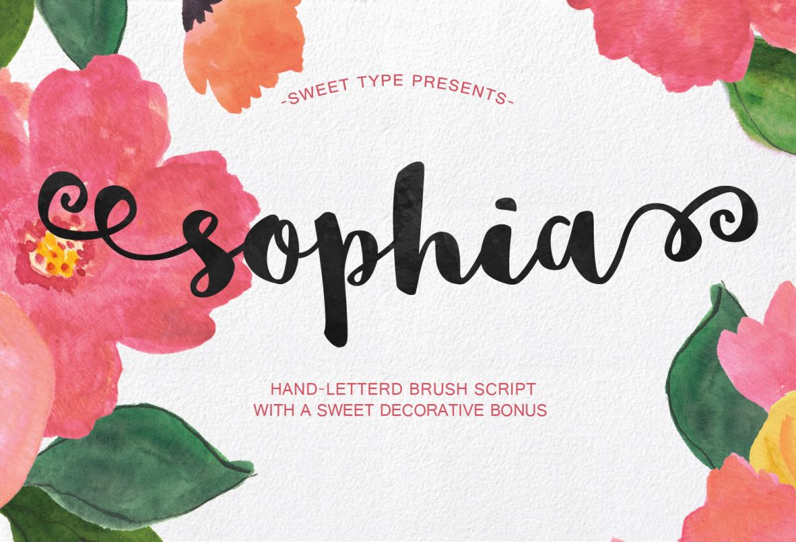

# Python Decorative Text Generator


## Overview

This is a Python script which uses the PIL package to generate a decorative text image. You can use the code in this script to automate something that might normally need to be done in Photoshop. 

This script will show you how to:

* Import a `.tff` font into Python (with PIL).
* Render some text with the font, centred to your image.
* Add 'handwritten' style decorative elements to the text.

Example use cases for this is creating custom hand-written style images for social media, or for sale on [Etsy](https://www.etsy.com/au/listing/782786122/custom-couple-names-print-custom-couple?ref=shop_home_active_33&frs=1&crt=1).

## Requirements

* [Python](https://www.python.org/downloads/) >= 3.6
* [Pillow](https://pypi.org/project/Pillow/) >= 7.2.0

```bash
# If you have pip, run this command to install the requirements.
pip install -r requirements.txt
```

## How to Use

```bash
# Go into the source folder.
cd src

# Run the generate_text script, with the text you want to generate as an argument.
python generate_text.py "hello world"

# If successful, your file will show up as "output.png."
```

## Configuration

In `generate_text.py` you can change the font size or the canvas size by modifying the lines:

```python
page_size = (800, 240)
font_size = 128
```

## References

The font featured in this script is [Sophia, from Sweet Type](https://www.behance.net/gallery/30281267/Sophia-Free-Handlettered-Brush-Script-Font).

